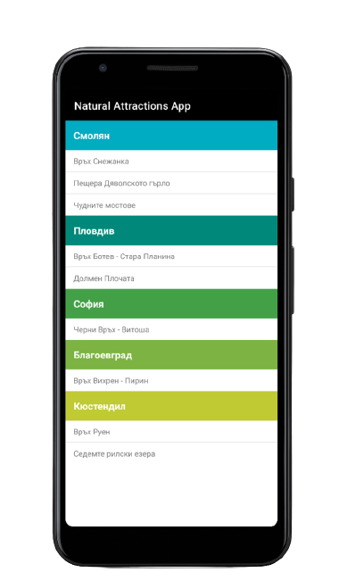
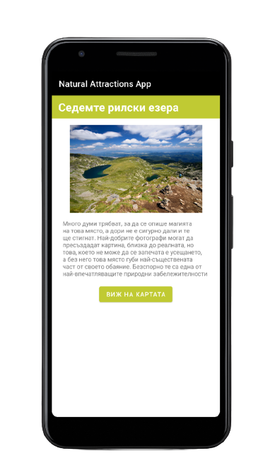
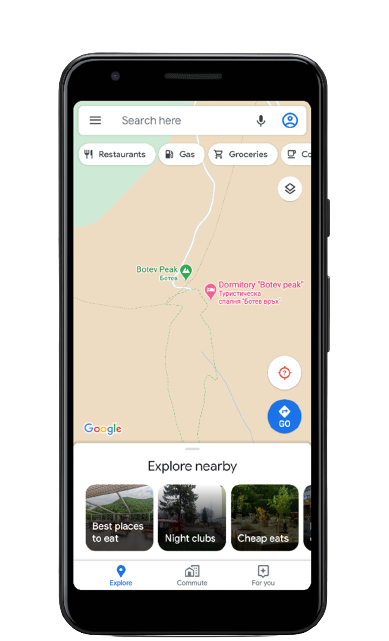

# ExploreNature Android App

## Quick Intro

ExploreNature is an Android app that provides information about various natural attractions, categorized by geographic regions. Users can explore a list of areas, each containing a list of natural landmarks. The app offers details, images, and the option to navigate to the chosen attraction using Google Maps. This project was created as a part of a university class.

## Prerequisites

Make sure you have [Android Studio](https://developer.android.com/studio) installed.

## Run

Simply clone the repo, load the project in Android Studio and run it.

## Detailed Explanation

### Functionality

The application consists of two views – the main view, representing a list of areas, each containing a list of natural landmarks in that region. Each area has its unique "color," which is highlighted when selecting a specific landmark. Opening a landmark leads to a second screen with additional information, title, and a "Show on Map" button inheriting the color of the respective area (e.g., Sofia's color is green, so titles and buttons for landmarks in Sofia are green). The second screen also includes brief information about the object, an image, and a "Show on Map" button. Pressing the button starts an activity that opens Google Maps with the coordinates of the object.

**Key features include:**

- Loading information for five predefined areas.
- Loading names of various natural landmarks, categorized by geographic region.
- Loading additional information, images, and descriptions for selected landmarks.
- Redirecting to Google Maps with coordinates for the selected landmark.

### Design View Schemes

The app uses two activity classes described in two XML files. In addition to the main views, the app utilizes a view for presenting an area with a list of adjacent natural landmarks and a view for the layout of a separate item from the list.

- **Main view:** `activity_main.xml`

  - Contains a list of areas with natural landmarks.
  - The main view is a `LinearLayout` containing a `RecyclerView` element, which holds a list of `group_item` elements representing individual areas with their sub-elements.
  - Each element in the `RecyclerView` is a `group_item`, implemented using a `RecyclerView.Adapter` called `CustomAdapter` to process data and ensure proper functionality of the elements.
  - A `group_item` consists of a `RelativeLayout` with two components for title and content. The title is a `TextView` with specified attributes for color, size, etc. The list of attractions is implemented as a `CustomListView` element, a custom view inheriting from `ListView` to ensure proper visibility for all elements in the list.

- **Attraction view:** `activity_attraction.xml`
  - Upon selecting a specific item, an `Intent` is created, loading a new activity - `AttractionActivity`:
  - Includes a `TextView` for title and description.
  - Utilizes an `ImageView` for a photo.
  - Features a `Button` that creates an `Intent` opening Google Maps with specified coordinates depending on the object's location.

## Results

